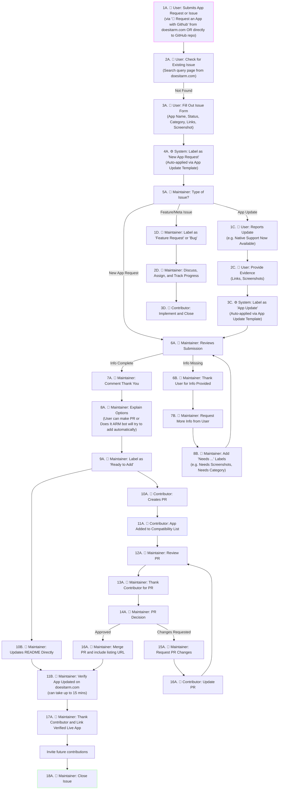

# App Request Flow

Flow for new app requests and updates to existing apps.

## Required contributor follow-up

Read this guide before handling app-request issues or app-listing pull requests.

1. Thank the contributor by their GitHub handle for the app or compatibility information they provided.
2. Include a direct Markdown link to the app's listing on `https://doesitarm.com` in merge and completion replies, for example `[Dusty on Does It ARM](https://doesitarm.com/app/dusty)`. The homepage, a GitHub diff, or the developer's website is not a substitute. For multiple apps, include a link for each.
3. Resolve the listing URL from the app's API `endpoint` or the repo's slug and endpoint helpers. Check redirects rather than guessing a URL from the PR title.
4. If deployment or verification is pending, still provide the expected listing URL, clearly label it as pending, and say it has not yet been verified live.
5. After the deployment finishes, open the public listing and verify the app name, compatibility status, version, and evidence links. The API and frontend deploy separately; a successful frontend build alone does not prove the new listing is live.
6. Reply on the PR with the verified listing link and a short thank-you. Check existing comments first to avoid duplicate live announcements. Close related app-request issues only after verification, including the listing link there too.
7. Before closing any issue, include a brief, friendly invitation to contribute again in the closing comment. Invite people to [browse the app list](https://doesitarm.com), [suggest another app](https://github.com/ThatGuySam/doesitarm/issues/new?template=app-request-template.yml), or [help with missing compatibility information](https://github.com/ThatGuySam/doesitarm/issues?q=is%3Aopen+is%3Aissue+label%3A%22Needs+M1+Testing%22). Pick the invitation that fits the contribution; one sentence is enough. Keep it optional and welcoming, with no obligation to do more work. This applies to completed, duplicate, and not-planned issue closures, including feature and bug issues. For non-listing issues, link the relevant result or explanation instead of inventing an app URL.
8. Treat the invitation as part of the closure checklist, not optional polish: verify the closing comment contains the thank-you, the result or direct app link, and the invitation before changing the issue state. If the user requests review before closure, leave the issue open and prepare the closing reply for that later step.

Example after verification:

> Thanks @contributor for adding Dusty and its compatibility evidence! It's now live: [Dusty on Does It ARM](https://doesitarm.com/app/dusty). Feel free to [browse the app list](https://doesitarm.com) and [suggest another app](https://github.com/ThatGuySam/doesitarm/issues/new?template=app-request-template.yml) you'd like us to review!

If deployment or public-page verification fails, report the actual blocker and arrange follow-up. Do not announce that the app is live until verified.

## Review criteria

Use the current [PR template](../.github/PULL_REQUEST_TEMPLATE/app_addition_template.md) for listing format, ordering, status wording, and supported-version requirements. Use the matching [request](../.github/ISSUE_TEMPLATE/app-request-template.yml) or [update](../.github/ISSUE_TEMPLATE/app-update-template.yml) form for issue completeness. Check the existing README category, duplicates, and related contributions.

- Open the official app/download page and compatibility evidence. Confirm that the evidence supports the stated architecture, app version, and stable or prerelease channel. Distinguish native or universal binaries from translation support.
- Prefer a versioned release or other durable evidence for a version-specific claim. A moving `latest` URL, mismatched version, or broken link needs reconciliation. Use a verifiable version or request the missing evidence; do not invent one or assume the newest release proves the first supported version.
- Distinguish contributor-provided screenshots or binary inspection output from checks performed independently. Report whether the review inspected sources, inspected a binary, or actually ran the Mac app.
- Inspect check and deployment details for the reviewed commit. Authorization requests and missing checks are not demonstrated build failures or successful checks. Respect required merge gates; report the actual cause and any uncertainty.
- For README-only edits, validate the changed entries against the template, evidence, category ordering, duplicates, and parsing where applicable. Read `package.json` and the affected tests for current commands; run relevant checks and required gates without expanding into unrelated refactors.

## Request and review flow

<!-- 
Mermaid Diagram Notes:
- All node labels MUST be wrapped in quotes ("text") when containing:
  * Special characters like parentheses ()
  * HTML tags like  
  * Single quotes within text 'text'
  * Emojis combined with special characters
- Without quotes, Mermaid throws parsing errors like "Expecting 'SQE'..."
- Do NOT wrap the entire code block in quotes - breaks markdown rendering
-->

```mermaid
flowchart TD
    A["1A. 👤 User: Submits App Request or Issue<br/>(via '🙋 Request an App with Github' from doesitarm.com OR directly to GitHub repo)"] --> B["2A. 👤 User: Check for Existing Issue<br/>(Search query page from doesitarm.com)"]
    B -- Not Found --> C["3A. 👤 User: Fill Out Issue Form<br/>(App Name, Status, Category, Links, Screenshot)"]
    C --> D["4A. ⚙️ System: Label as 'New App Request'<br/>(Auto-applied via App Update Template)"]
    D --> E["5A. 🔧 Maintainer: Type of Issue?"]
    E -- New App Request --> F["6A. 🔧 Maintainer: Reviews Submission"]
    F -- Info Complete --> F2["7A. 🔧 Maintainer: Comment Thank You"]
    F2 --> F3["8A. 🔧 Maintainer: Explain Options<br/>(User can make PR or Does It ARM bot will try to add automatically)"]
    F3 --> G["9A. 🔧 Maintainer: Label as 'Ready to Add'"]
    F -- Info Missing --> H0["6B. 🔧 Maintainer: Thank User for Info Provided"]
    H0 --> H["7B. 🔧 Maintainer: Request More Info from User"]
    H --> H2["8B. 🔧 Maintainer: Add 'Needs ...' Labels<br/>(e.g. Needs Screenshots, Needs Category)"]
    H2 --> F
    
    G --> I["10A. 👥 Contributor: Creates PR"]
    G --> I2["10B. 🔧 Maintainer: Updates README Directly"]
    I --> J["11A. 👥 Contributor: App Added to Compatibility List"]
    I2 --> I3["11B. 🔧 Maintainer: Verify App Updated on doesitarm.com<br/>(can take up to 15 mins)"]
    J --> J1["12A. 🔧 Maintainer: Review PR"]
    J1 --> J2["13A. 🔧 Maintainer: Thank Contributor for PR"]
    J2 --> J3["14A. 🔧 Maintainer: PR Decision"]
    J3 -- Changes Requested --> J4["15A. 🔧 Maintainer: Request PR Changes"]
    J4 --> J5["16A. 👥 Contributor: Update PR"]
    J5 --> J1
    J3 -- Approved --> J6["16A. 🔧 Maintainer: Merge PR and include listing URL"]
    J6 --> I3
    I3 --> L1["17A. 🔧 Maintainer: Thank Contributor and Link Verified Live App"]
    L1 --> L2["Invite future contributions"]
    L2 --> K["18A. 🔧 Maintainer: Close Issue"]

    E -- App Update --> L["1C. 👤 User: Reports Update<br/>(e.g. Native Support Now Available)"]
    L --> M["2C. 👤 User: Provide Evidence<br/>(Links, Screenshots)"]
    M --> N["3C. ⚙️ System: Label as 'App Update'<br/>(Auto-applied via App Update Template)"]
    N --> F

    E -- Feature/Meta Issue --> O["1D. 🔧 Maintainer: Label as 'Feature Request' or 'Bug'"]
    O --> P["2D. 🔧 Maintainer: Discuss, Assign, and Track Progress"]
    P --> Q["3D. 👥 Contributor: Implement and Close"]

    style A stroke:#f9f,stroke-width:2px
    style J stroke:#bbf,stroke-width:2px
    style K stroke:#bfb,stroke-width:2px
```
