# App Request Flow

Flow for new app requests and updates to existing apps

<!-- 
Mermaid Diagram Notes:
- All node labels MUST be wrapped in quotes ("text") when containing:
  * Special characters like parentheses ()
  * HTML tags like  
  * Single quotes within text 'text'
  * Emojis combined with special characters
- Without quotes, Mermaid throws parsing errors like "Expecting 'SQE'..."
- Do NOT wrap the entire code block in quotes - breaks markdown rendering
-->

```mermaid
flowchart TD
    A["👤 User: Submits App Request or Issue"] --> B{"🔧 Maintainer: Type of Issue?"}
    B -- New App Request --> C["⚙️ System: Check for Existing Issue"]
    C -- Not Found --> D["👤 User: Fill Out Issue Form<br/>(App Name, Status, Category, Links, Screenshot)"]
    D --> E["⚙️ System: Label as 'New App Request'"]
    E --> F["🔧 Maintainer: Reviews Submission"]
    F -- Info Complete --> G["🔧 Maintainer: Label as 'Ready to Add'"]
    F -- Info Missing --> H["🔧 Maintainer: Request More Info from User"]
    H --> H2["🔧 Maintainer: Add 'Needs ...' Labels<br/>(e.g. Needs Screenshots, Needs Category)"]
    H2 --> F
    G --> I["👥 Contributor: Creates PR"]
    I --> J["👥 Contributor: App Added to Compatibility List"]
    J --> K["⚙️ System: Close Issue"]

    B -- App Update --> L["👤 User: Reports Update<br/>(e.g. Native Support Now Available)"]
    L --> M["👤 User: Provide Evidence<br/>(Links, Screenshots)"]
    M --> N["🔧 Maintainer: Label as 'App Update'"]
    N --> F

    B -- Feature/Meta Issue --> O["🔧 Maintainer: Label as 'Feature Request' or 'Bug'"]
    O --> P["🔧 Maintainer: Discuss, Assign, and Track Progress"]
    P --> Q["👥 Contributor: Implement and Close"]

    style A stroke:#f9f,stroke-width:2px
    style J stroke:#bbf,stroke-width:2px
    style K stroke:#bfb,stroke-width:2px
```

